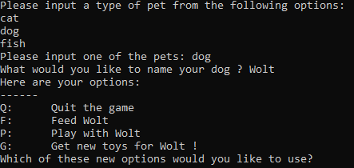
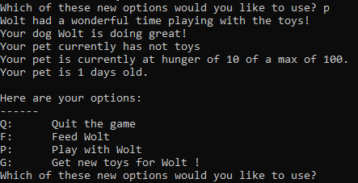
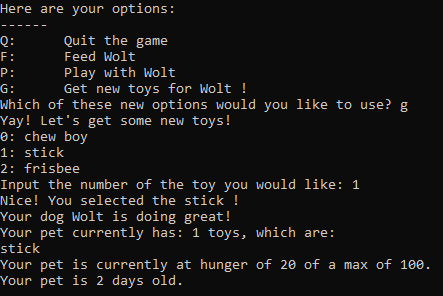
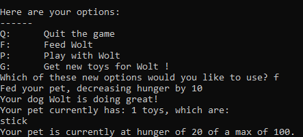
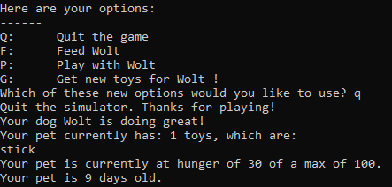

# Tamagotchi game

### By Khazratkulov Ziyobek

#### Table of contents
[Describtion](#describtion)\
[Usage](#usage)\
[Commands](#command)

<a name="describtion"><h3>Describtion</h3></a>
---------------------------------------
 In the Tamagotchi game, you can name, feed, and play with your own virtual pet.\
 First of all, you can choose one of the types of pet and then you can give name to your pet.\
 Finally, you can choose commands below. Enjoy with playying :)
 Here some examples:

<a name="usage"><h3>Usage</h3></a>
---------------------------------------
To run code follow instructions below:\
- git clone https://github.com/Khazratkulov-Ziyobek/Review1.git
- cd Review1
- python3 tamagotchi.py

<a name="command"><h3>Commands</h3></a>
--------------------------------------
- To quit game enter 'Q' or 'q'
- For feeding enter 'F' or 'f'
- For playing enter 'P' or 'p'
- For giving toys enter 'G' or 'g'
